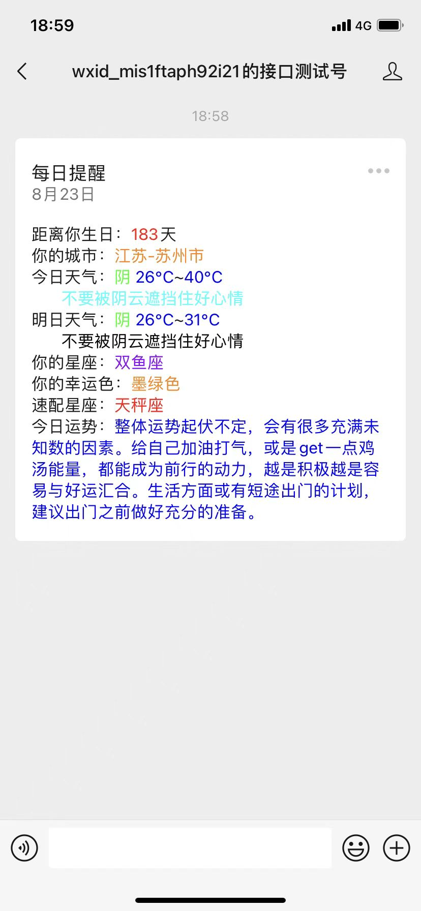
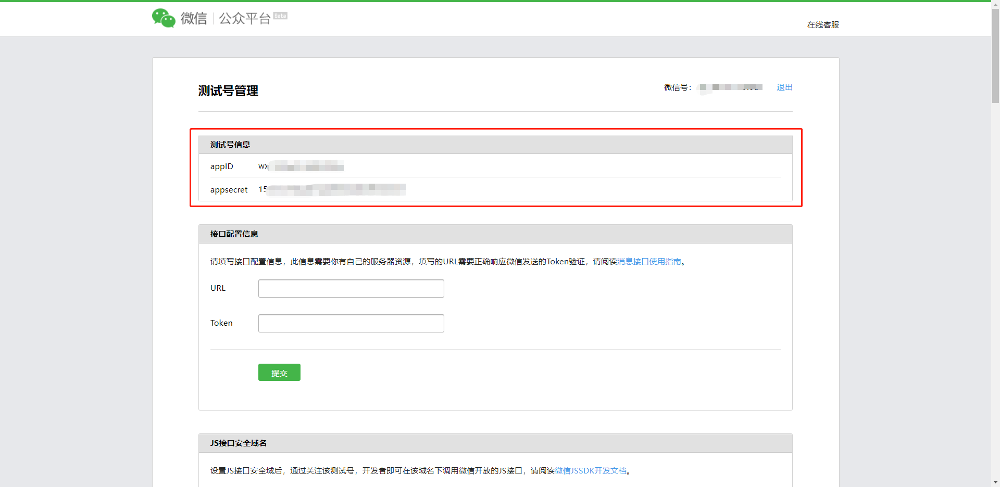
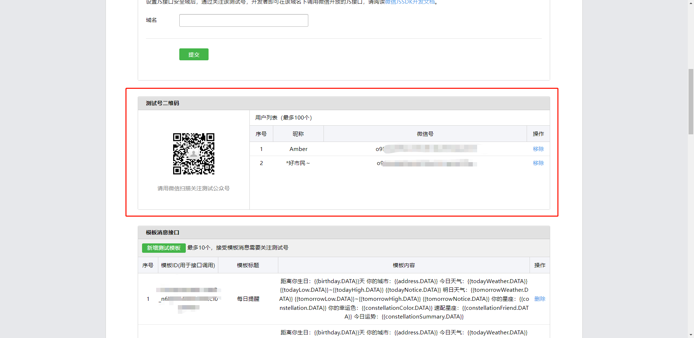
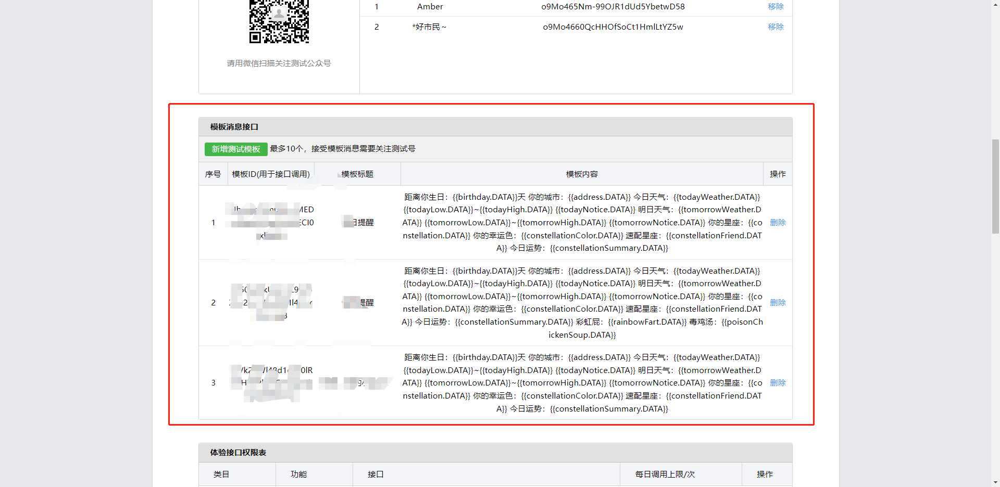
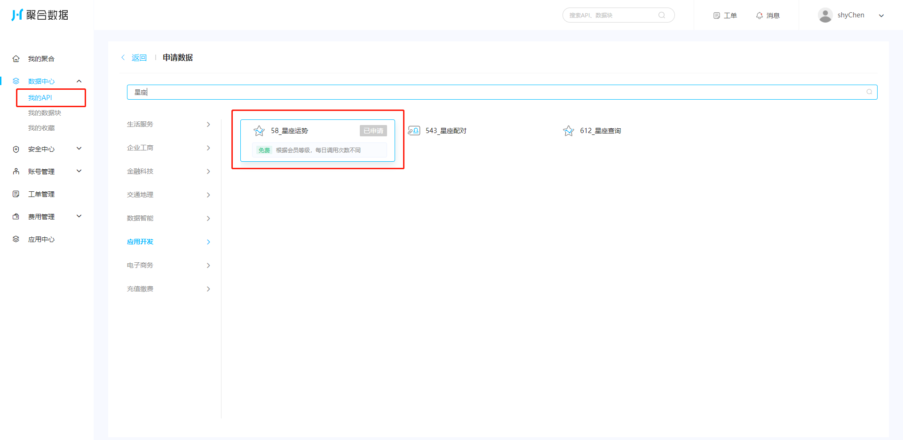
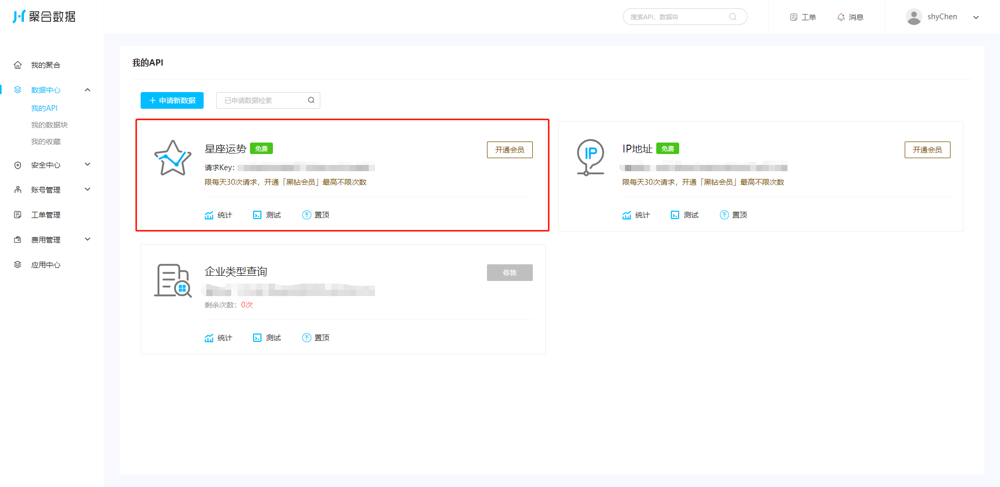
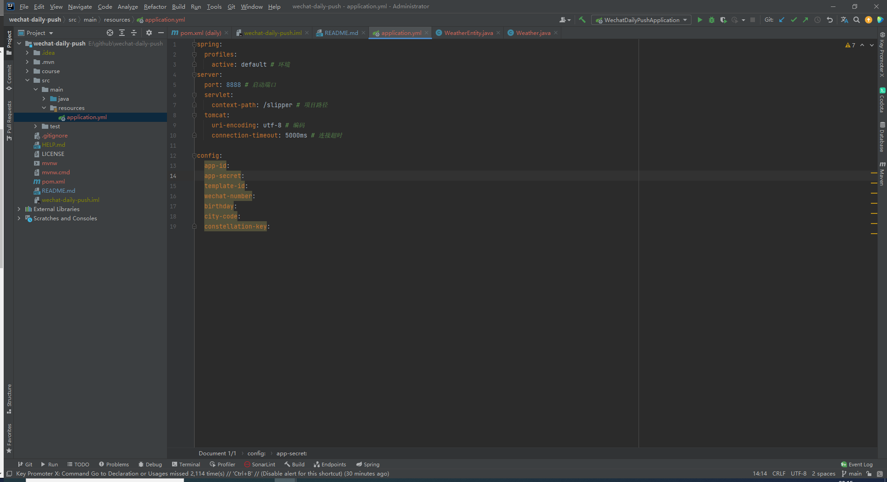
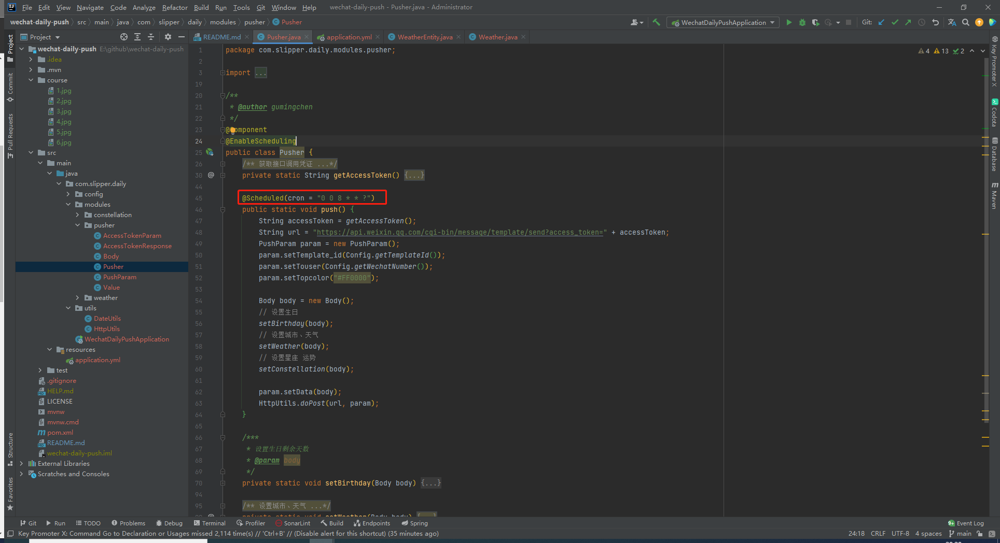

### 最近程序员给对象写的微信推送貌似很火，闲来无事用java实现了一下，有兴趣的小伙伴们可以浅尝一下！


## 注册微信测试帐号
微信推送首先就要有一个可以使用的推送帐号，先到微信的公众平台注册一个测试帐号。

<a href="https://mp.weixin.qq.com/debug/cgi-bin/sandbox?t=sandbox/login">
    
</a>

### 注册

记住图片中的 `appID` 和 `appsecret` ，后续需要在代码的配置文件中修改这个数据。

### 添加帐号
往下滚动页面会看到 __测试号二维码__ 这一个面板，需要使用接收推送消息的微信扫描左侧的二维码进行微信帐号添加。


### 添加消息模版
往下滚动页面会看到 __模板消息接口__ 这一个面板，需要新增一个消息模版进行消息的推送。

记住图片中的 `模板ID` ，后续需要在代码的配置文件中修改这个数据。

使用到的模版已经贴在下方，直接复制创建即可。
```aidl
距离你生日：{{birthday.DATA}}天
你的城市：{{address.DATA}}
今日天气：{{todayWeather.DATA}} {{todayLow.DATA}}~{{todayHigh.DATA}}
       {{todayNotice.DATA}}
明日天气：{{tomorrowWeather.DATA}} {{tomorrowLow.DATA}}~{{tomorrowHigh.DATA}}
       {{tomorrowNotice.DATA}}
你的星座：{{constellation.DATA}}
你的幸运色：{{constellationColor.DATA}}
速配星座：{{constellationFriend.DATA}}
今日运势：{{constellationSummary.DATA}}
```

## 注册聚合帐号
推送的星座信息是调用的第三方的接口，每天有免费调用次数，需要先注册一个聚合帐号并实名认证。

<a href="https://www.juhe.cn/">
    
</a>

### 添加星座运势API
注册成功之后进入到个人中心，个人中心左侧菜单栏中有个 `数据中心` `我的API`，进入到 `我的API` 申请新数据。
搜索 `星座` 可以出来 `58_星座运势`，点击申请。

再回到 `我的API` 页面可以看到 `星座运势` 已经被添加进来。

记住图片中的 `请求Key` ，后续需要在代码的配置文件中修改这个数据。
如果没有实名认证是没有这个值的，需要先进行实名认证。

## 天气
项目中使用到的天气也是调用的第三方的接口，是免费的。
但是这个接口需要用到区域码，如果不知道自己的区域码的，可以点开下面这个传送门查找自己城市的区域码。

<a href="https://yiyingcanfeng.github.io/data/2019-03-13-cn_weather_citylist.json">
    
</a>

记住所在城市的 `cityCode` 区域码，后续需要在代码的配置文件中修改这个数据。

## 运行项目
### 先从Github上下载该项目
```shell
# 克隆项目
git clone https://github.com/gmingchen/wechat-daily-push.git
```
### 使用IDEA开发工具打开项目并修改配置
`若是没有java 和 maven 环境需要自行百度安装`

打开 src/main/resources/application.yml

具体配置填写内容如下一一对应
```shell
config:
  app-id: # 填写之前记住的测试帐号的 appID
  app-secret: # 填写之前记住的测试帐号的 appsecret
  template-id: # 填写之前新增模版的ID
  wechat-number: # 填写之前扫码绑定微信的微信号
  birthday: # 当然填写女朋友的生日啦 如：1995-08-05
  city-code: # 填写所在地区的区域码
  constellation-key: # 聚合网站API的 请求Key
```

## 其他
项目运行之后会在每天早上8点进行消息推送。
如果要修改时间，打开 src/main/java/com/slipper/daily/modules/pusher/pusher 文件，
修改如下图中的表达式即可。

提供几个常用 `cron` 表达式
```shell
# 每天6点
0 0 6 * * ?
# 每天7点
0 0 7 * * ?
# 每天8点半
0 30 8 * * ?
# 每天12点半
0 30 12 * * ?
```
如果有服务器亦可以打包到服务器后台运行（前提是服务器有java运行环境）。
### 打包
```bash
# 打包之前建议先清理项目缓存
mvn clean

# 打包
mvn package
```

### 发布
将打包好的 jar 包（wechat-daily-push/target/daily-0.0.1-SNAPSHOT.jar）放到服务器中并运行。
```bash
# 查看运行进程
ps aux | grep daily-0.0.1-SNAPSHOT.jar

# 杀掉运行进程
kill -9 pid

# 运行 jar 包
nohup java -Xms10m -Xmx50m -jar daily-0.0.1-SNAPSHOT.jar &
```
